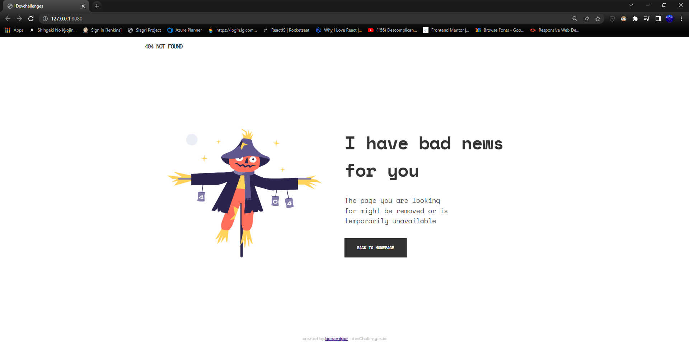
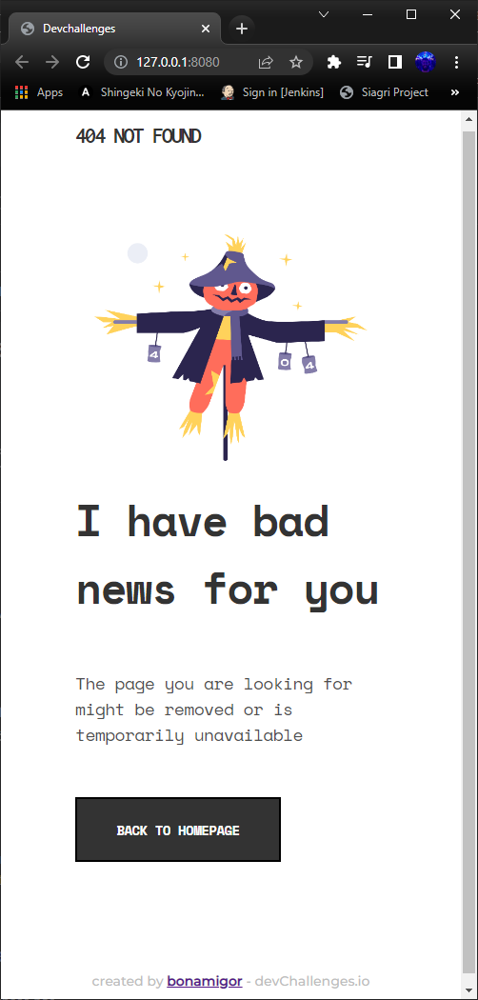

<!-- Please update value in the {}  -->

<h1 align="center">404 Not Found Page</h1>

   Solution for a challenge from  <a href="http://devchallenges.io" target="_blank">Devchallenges.io</a>.

  <h3>
    <a href="https://{your-demo-link.your-domain}">
      Demo
    </a>
     | 
    <a href="https://{your-url-to-the-solution}">
      Solution
    </a>
     | 
    <a href="https://devchallenges.io/challenges/wBunSb7FPrIepJZAg0sY">
      Challenge
    </a>
  </h3>

<!-- TABLE OF CONTENTS -->

## Table of Contents

- [Overview](#overview)
  - [Built With](#built-with)
- [Features](#features)
- [Contact](#contact)
- [Acknowledgements](#acknowledgements)

<!-- OVERVIEW -->

## Overview

  
Desktop

  
   
  
Mobile

  

 

- <strong>Where can I see your demo?</strong>
  - To see my demo you just have to go to > [404](http://github.com/bonamigor) and resize the browser's window and see the responsive page working!
- <strong>What was your experience?</strong>
  - It was pretty good to have the figma's layout to use it as my start point, so I basically followed the 'instructions'
- <strong>What have you learned/improved?</strong>
  - I've improved my knowledge on how responsive pages work and how to organize better the HTML so responsive pages doesn't become nightmares

### Built With

<!-- This section should list any major frameworks that you built your project using. Here are a few examples.-->
- [HTML]
- [SASS]

## Features

<!-- List the features of your application or follow the template. Don't share the figma file here :) -->

This application/site was created as a submission to a [DevChallenges](https://devchallenges.io/challenges) challenge. The [challenge](https://devchallenges.io/challenges/wBunSb7FPrIepJZAg0sY) was to build an application to complete the given user stories.

## Acknowledgements

<!-- This section should list any articles or add-ons/plugins that helps you to complete the project. This is optional but it will help you in the future. For exmpale -->

- [Node.js](https://nodejs.org/)
- [Live-Server](https://www.npmjs.com/package/live-server)
- [Access the project's directory and run 'npx live-server' in terminal](https://www.npmjs.com/package/live-server)

## Contact

- Website [building it!](https://github.com/bonamigor/whoami)
- GitHub [@bonamigor](https://github.com/bonamigor)
- Twitter [@bonamigor](https://twitter.com/bonamigor)
